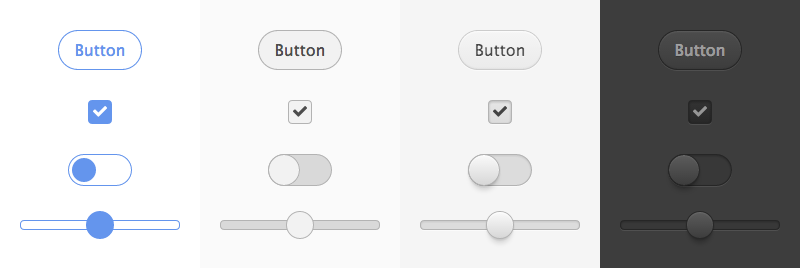

# digit

Touch-optimized [Montage](https://github.com/montagejs/montage) components for tablets and phones.

Note: Digit is currently still __work in progress__.

## Install

The Digit components depend on the MontageJS framework which isn't included in the repository. If you have npm installed already, `cd` into the Digit's directory and simply type:

    npm install

It will add MontageJS and all the other dependencies. Then you can preview the components on your local server by going to `[path-to-digit]/overview`.

## Components

These are just a few examples, [see them all](overview).

## Maintenance

Tests are in the `test` directory. Use `npm test` to run the tests in
NodeJS or open `test/run.html` in a browser. 

To run the tests in your browser, simply use `npm run test:jasmine`.

To run the tests using Karma use `npm run test:karma` and for continious tests run with file changes detection `npm run test:karma-dev`.