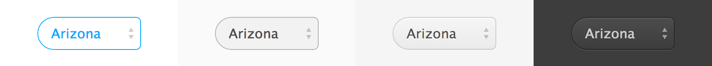
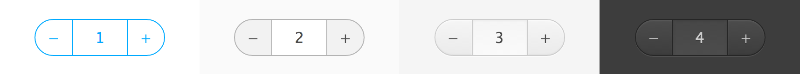

# digit
Touch-optimized [Montage](https://github.com/montagejs/montage) components for tablets and phones.

Note: Digit is currently still __work in progress__.

## Install

The Digit components depend on the MontageJS framework which isn't included in the repository. If you have npm installed already, `cd` into the Digit's directory and simply type:

    npm install

It will add MontageJS and all the other dependencies. Then you can preview the components on your local server by going to `[path-to-digit]/overview`.

## Components

These are just a few examples, [see them all](overview).
