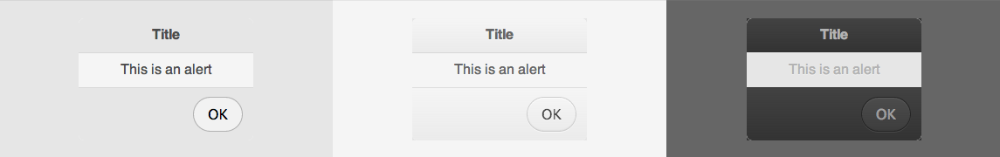

# Alert



The alert displays a message to the user, popping up above other content.

## How to use

```json
"alert": {
    "prototype": "ui/alert.reel",
    "properties": {
        "element": {"#": "alert"},
        "title": "A Title",
        "message": "A message",
        "okLabel": "Ok"
    }
}
```

```html
<div data-montage-id="alert"></span>
```


## Available properties

* `title` - The text to appear in the title bar.
* `message` - The text to appear in the body.
* `okLabel` - The text to appear in the button to dismiss the alert.


## Customizing with CSS

* `.digit-Alert` - The container element
* `.digit-Alert-header` - The header element
* `.digit-Alert-content` - The main content element
* `.digit-Alert-footer` - The footer element

```css
.digit-Alert-header {
    background: red;
}
```
