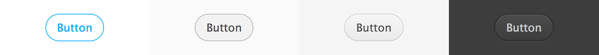

# Button



The Button component wraps a `<button>`, `<input type="button">` or `<a>` element, and exposes the standard attributes of those elements as properties, which you can use with data binding, for example.

## How to use

```json
"button": {
    "prototype": "digit/ui/button.reel",
    "properties": {
        "element": {"#": "button"}
    }
}
```

```html
<button data-montage-id="button">Button</button>
```


## Available properties

* `label` - Label of the button.


## Variations
* `digit-Button--glass` - Turns a button into a background/border-less square. 


## Customizing with CSS

* `.digit-Button` - The Button element

```css
.digit-Button {
    background-color: pink;
}
```
