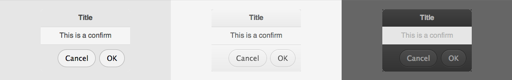

# Confirm



The confirm asks the user to accept or reject a message.

## How to use

```json
"confirm": {
    "prototype": "ui/confirm.reel",
    "properties": {
        "element": {"#": "confirm"},
        "title": "Warning",
        "message": "Are you sure you want to do this?",
        "okLabel": "Ok",
        "cancelLabel": "Nope!"
    }
}
```

```html
<div data-montage-id="confirm"></span>
```


## Available properties

* `title` - The text to appear in the title bar.
* `message` - The text to appear in the body.
* `okLabel` - The text to appear in the button to accept.
* 'cancelLabel' - The text to appear in the button to cancel.


## Customizing with CSS

* `.digit-Confirm` - The container element
* `.digit-Confirm-header` - The header element
* `.digit-Confirm-content` - The main content element
* `.digit-Confirm-footer` - The footer element

```css
.digit-Confirm-header {
    background: red;
}
```
