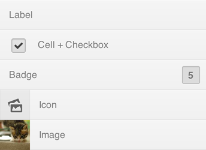

# List


The List component wraps an `<ul>` element. It supports different kind of list item types.

## How to use

```json
"list": {
    "prototype": "digit/ui/list.reel",
    "properties": {
        "element": {"#": "list"}
    }
}
```

```html
<ul data-montage-id="list"></ul>
```


## Available properties

* `items` - List items.


## Customizing with CSS

* `.digit-List` - The List component
* `.digit-ListItem` - The list item (`<li>`)

```css
.digit-ListItem {
    background-color: pink;
}
```


## Different List-item types

A List-item can contain just a label with text. Or it can be mixed and matched with the following: 

* `.digit-ListItem-label` - Can have text inside.
* `.digit-ListItem-cell` - An empty container that centers its child. This is great for adding other controls like a Checkbox or Toggle.
* `.digit-ListItem-badge` - Pushed back text. Mostly used for numbers, notifications or other kind of text/label that should be highlighted.
* `.digit-ListItem-icon` - An icon. Great for giving a visual hint or group the items.
* `.digit-ListItem-image` - And image. Can be used for avatars or thumbnails. Minimum size: 50x50 (100x100 for Retina). Also note that if the images are not a square, they get cropped and centered.


