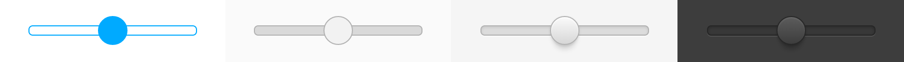

# Slider



The Slider component wraps an HTML `<input type="range">` element.

## How to use

```json
"slider": {
    "prototype": "digit/ui/slider.reel",
    "properties": {
        "element": {"#": "slider"}
    }
}
```

```html
<input data-montage-id="slider" type="range">
```


## Available properties

* `max` - Maximal value.
* `value` - Current value of the Slider.


## Customizing with CSS

* `.digit-Slider` - The track of the Slider element
* `.digit-Slider-thumb` - The thumb of the Slider element
* `.digit-Slider-thumbTrack` - The element which bounds the motion of the thumb, If the width of the thumb is changed the right property should be adjusted.

```css
.digit-Slider {
    border-color: blue;
}
.digit-Slider-thumb {
    background-color: pink;
}
```